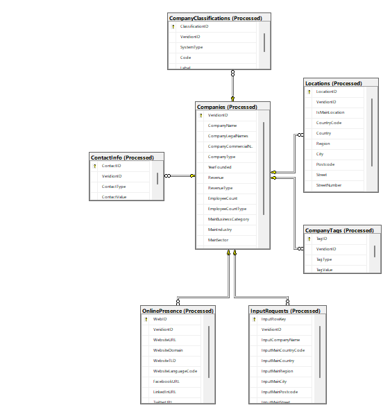

# Supplier Master Data Management System

**Author:** Maria Păduraru  
**Project Type:** SQL Data Normalization & Entity Linking

## 📌 Project Overview
This project focuses on transforming flat, raw business data (CSV/Input requests) into a highly normalized relational database. The core objective is to manage **Supplier Master Data** by linking client input requests to a verified central entity database using a unique identifier (**VeridionID**).

The system is designed to handle complex data types such as social media presence, multi-industry classifications (NAICS/NACE/ISIC), and multi-contact information, ensuring data integrity and eliminating redundancy.

## 🏗️ Database Architecture (ERD)
The database follows a star-schema-like normalization approach to manage 1-to-many relationships effectively.

### Key Entities:
* **Companies (Main Table):** Stores core entity data (VeridionID, Revenue, Employee count, Founding year).
* **InputRequests:** Captures original client search data and maps it to a `VeridionID` after the matching process.
* **Locations:** Detailed geographical data including headquarters and secondary branches.
* **CompanyClassifications:** A centralized table for various industry standards (SICS, NAICS, NACE, ISIC, SIC).
* **ContactInfo & OnlinePresence:** Granular storage for phones, emails, and social media handles (Facebook, LinkedIn, etc.).

## 🛠️ Technical Features

### 1. Data Normalization
Instead of using single columns with pipe-separated values (`|`), the system breaks down complex arrays into related tables:
* **Industry Codes:** Stored via `Type | Code | Label` mapping.
* **Contacts:** Categorized by `Contact Type` (Primary Phone, Secondary Email, etc.).
* **Tags:** Individual business tags are extracted for better filtering and searchability.

### 2. Entity Linking (The VeridionID Logic)
The system uses the `VeridionID` as a bridge between messy input data and verified records:
* **Traceability:** Every client request is linked to a specific legal entity.
* **Deduplication:** Multiple different inputs (e.g., "Starbucks SRL" vs "Starbucks Romania") are resolved to a single unique `VeridionID`.
* **Integrity:** Foreign key constraints prevent the deletion of companies that have associated historical input requests.

### 3. Handling Complex Metadata
* **CompanyTags:** Efficiently lists business descriptors.
* **OnlinePresence:** Tracks TLDs, domains, and full URLs for social platforms.

## 🔍 Data Integrity Rules
* **Uniqueness:** Primary keys are enforced across all tables to prevent record duplication.
* **Mapping:** The `InputRequests` table uses `VeridionID` as a Foreign Key, allowing for NULL values when a search query fails to find a match in the master database.

## 🔍 Data Analysis & QC Observations
During the project, I performed a deep-dive analysis using T-SQL to identify inconsistencies. Below are the findings:

### 1. Technical Integrity & Data Types
* **Issue:** Identified a **Varchar-to-Int Overflow** error in the `Revenue` column. High-value strings (e.g., `52,960,000,248`) exceeded standard integer limits.
* **Solution:** Implemented `TRY_CAST` to `DECIMAL(38,0)` to ensure all financial data is calculable without system crashes.

### 2. Missing Data Statistics
After running a completeness audit on **2,716 total records**, I observed:
* **Missing Revenue:** 1,276 records (47%).
* **Missing Employee Count:** 1,192 records (44%).
* **Missing Industry Classification:** 316 records (11%).

### 3. Data Strengths
* **Location Integrity:** 100% of the analyzed records have complete address data (City, Postcode, Street). No null or empty strings were found in critical address fields.
* **Content Richness:** 100% of entities possess at least one form of text description (Short, Long, or Generated), ensuring no "empty profiles" exist.

---

## 🛠️ Data Curation Strategy
To prepare this dataset for a production-level client delivery, I defined the following curation rules:

1.  **Financial Normalization:** Convert all `Revenue` strings to a unified numeric format and apply "median-imputation" based on the `MainSector` for records with missing values.
2.  **Geographical Standardization:** Use a **Cross-Reference validation** (mapping `CountryCode` to ISO Standard names) to correct discrepancies (e.g., ensuring 'US' always maps to 'United States').
3.  **Entity Flattening:** For clients requiring a "one-row-per-company" view, filter locations to only export the record where `IsMainLocation = 'true'`.
4.  **Fallback Logic:** In cases where `CompanyLegalName` is missing, the system is programmed to fall back to `CompanyName` to maintain record usability in CRM systems.

---

## 💻 SQL Scripts Used
The following logic was applied (Full scripts available in the repository):

* **Entity Relationship Check:** Verified that each company has exactly one main location using `SUM(CASE WHEN IsMainLocation = 'true'...)` and `HAVING` clauses.
* **Completeness Audit:** Multi-column null/empty check with `COUNT_BIG` and `CAST AS BIGINT` for large-scale data handling.
* **ISO Validation:** A CTE-based approach to cross-reference internal country names against global standards.
* **Description Quality:** `LEN()` based filters to identify and flag poor-quality or placeholder descriptions (e.g., 'N/A').

## 🚀 Use Cases
* **B2B Lead Enrichment:** Cleaning and expanding simple company names into full profiles.
* **Supplier Risk Management:** Maintaining a single "Golden Record" for vendors.
* **Market Analysis:** Querying companies based on specific industrial classifications (e.g., "All companies with NACE code X").

---

### 💻 Technologies Used
* **SQL Server (T-SQL)**: For relational mapping and constraint enforcement.
* **Relational Design**: 3rd Normal Form (3NF) principles.
* **Data Architecture**: Entity Linking & Master Data Management (MDM) logic.